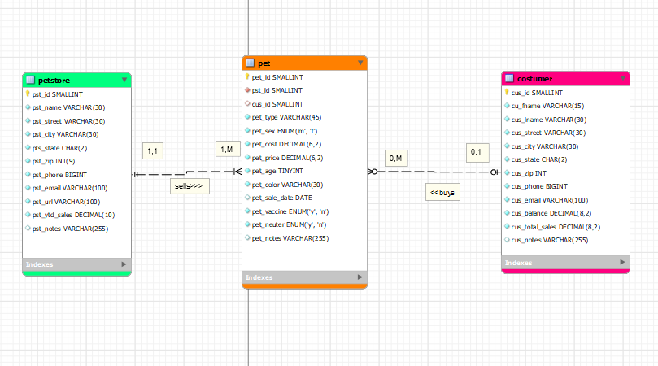
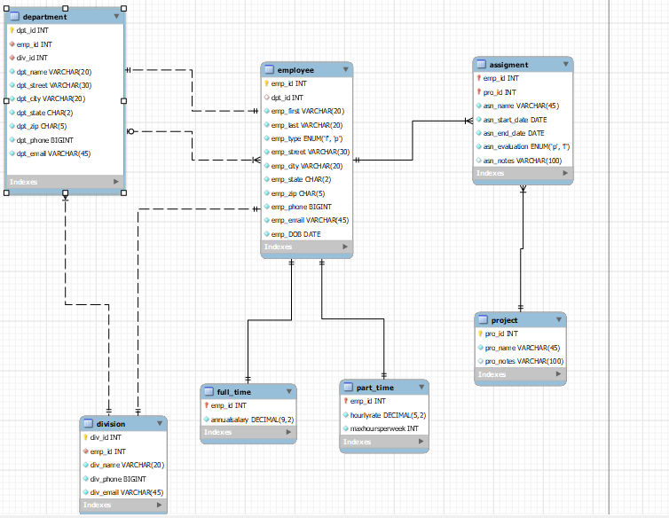
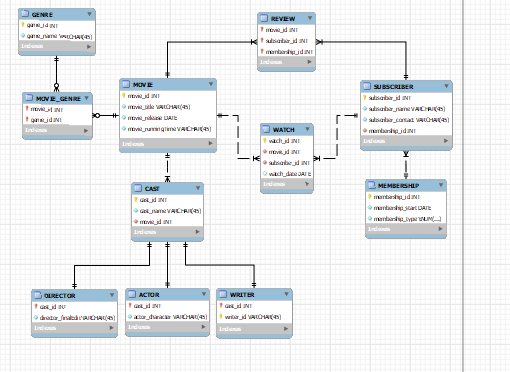
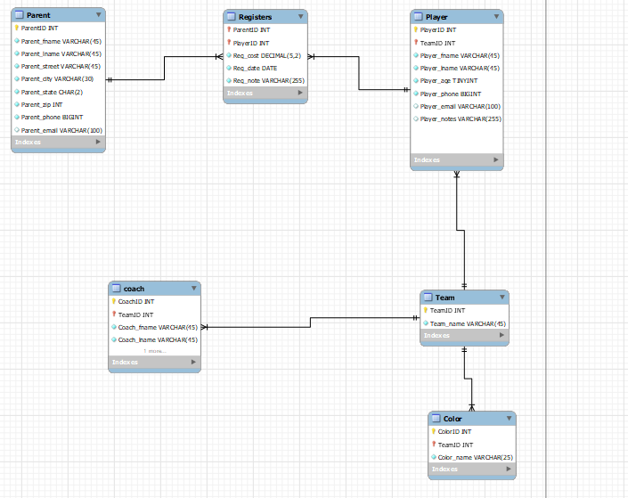
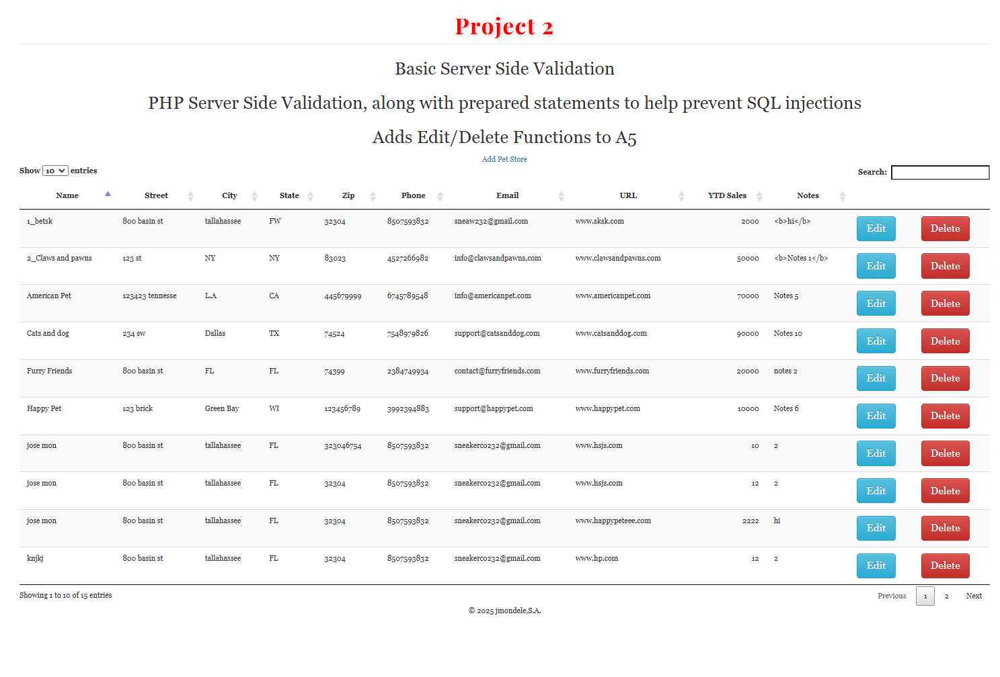
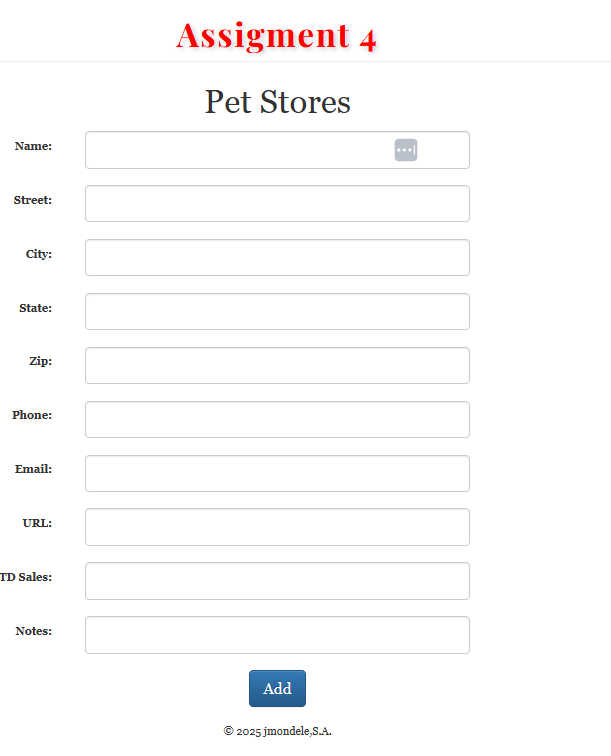

# 🗃️ SQL & Backend Projects

This folder includes SQL-based relational modeling and a secure server-side CRUD application built with PHP + MySQL. Projects demonstrate data design, normalization, and backend logic.

---

## 🔹 ERD Diagrams (MySQL Workbench)

Each ERD models real-world systems with entities, relationships, and normalized structures.

### 📦 Pet Store System
Tracks pets, customers, and inventory.

---

### 🏢 Workforce Management
Departments, employees, full-time/part-time roles, and project assignments.

---

### 🎬 Movie Streaming Platform
Movies, genres, casts, users, reviews, and viewing history.

---

### ⚽ Youth Soccer League
Tracks teams, players, parents, coaches, and registrations.

---

## 🔐 PHP CRUD: Pet Store Admin Tool

A full CRUD web app built in PHP + MySQL with secure prepared statements and user input validation.

### 🔑 Features:
- Create, edit, delete pet store records  
- Server-side validation  
- Searchable table with pagination (DataTables.js)  
- SQL injection protection using prepared statements

### 💻 Screenshot:

📁 Includes: `index.php`, `edit.php`, `delete.php`, `connect.php`, sample database schema and UI assets.

---

## 🛠️ Skills Demonstrated

- SQL (joins, foreign keys, normalization, constraints)  
- MySQL Workbench (ERDs)  
- PHP (CRUD logic, validation, secure forms)  
- JavaScript + DataTables  
- Bootstrap for UI design

---

## 📇 Author

**Jose Mon**  
Florida State University | IT Student  
📎 [LinkedIn](https://www.linkedin.com/in/jose-mon-675a67311/)
