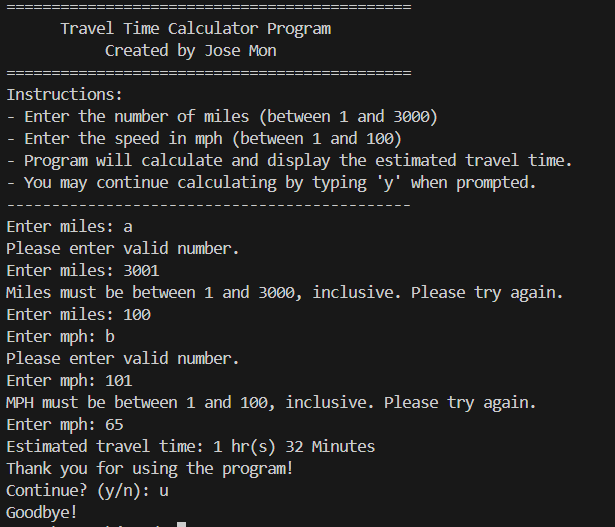

# 🚗 SS10 - Travel Time Calculator (Console)

## 📋 Description
This Java console program calculates the **estimated travel time** based on user input for **distance (in miles)** and **speed (in mph)**. It provides a clean interface, detailed instructions, and prompts the user to repeat calculations as desired.

---

## 💡 Features
- Console-based interface with instructional header
- Input validation for:
  - **Miles**: must be between 1 and 3000
  - **MPH**: must be between 1 and 100
- Converts total travel time into **hours and minutes**
- Allows the user to repeat calculations by typing `'y'`
- Friendly feedback messages for invalid input

---

## 📂 Source Code
- [TravelTimeCalculator.java](./TravelTimeCalculator.java)

---

## 🖼️ Screenshot

---

## 🧪 Sample Output

============================================= Travel Time Calculator Program Created by Jose Mon
Instructions:

Enter the number of miles (between 1 and 3000)

Enter the speed in mph (between 1 and 100) ... Enter miles: 120 Enter mph: 60 Estimated travel time: 2 hr(s) 0 Minutes Thank you for using the program! Continue? (y/n):
---

## ⚙️ How to Run
1. Open `TravelTimeCalculator.java` in your IDE
2. Compile and run the program
3. Enter valid inputs when prompted
4. Repeat or exit as needed

---

## 🛠️ Technologies Used
- Java
- `Scanner` for user input
- `Math.round()` and arithmetic logic
- Looping for repeat option

---

## 📚 Concepts Practiced
- Defensive programming with validation
- Arithmetic conversion of decimal time
- Looping and program flow control
- Clean user communication in console apps

---

## ✏️ Author
**Jose Mon**  
Florida State University | IT Student  
[LinkedIn](https://www.linkedin.com/in/jose-mon-675a67311/)
