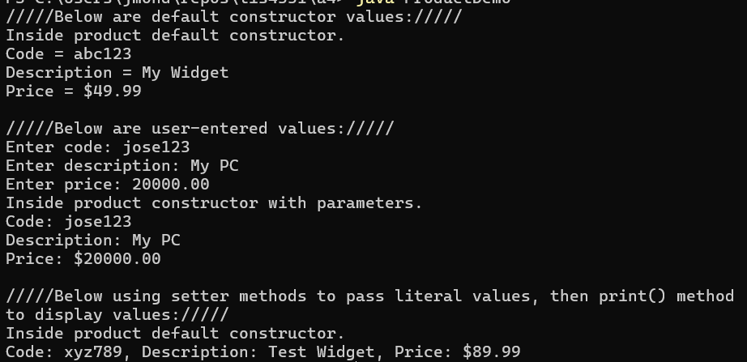

# 📦 SS11 - Product Class (OOP)

## 📋 Description
This Java console program demonstrates the use of **Object-Oriented Programming** by creating a `Product` class. It includes constructors, getters/setters, and a method to display formatted product information. The program shows how to use:
- Default constructor
- Parameterized constructor
- Setter methods to manually set values

---

## 💡 Features
- **Product class** with:
  - `code` (String)
  - `description` (String)
  - `price` (double)
- **Default constructor**: assigns default values
- **Parameterized constructor**: accepts values from user input
- **Setters**: to update object attributes after creation
- **print() or toString()** method: to display product info

---

## 🧪 Sample Console Output
/////Below are default constructor values:///// Inside product default constructor. Code = abc123 Description = My Widget Price = $49.99

/////Below are user-entered values:///// Enter code: jose123 Enter description: My PC Enter price: 20000.00 Inside product constructor with parameters. Code: jose123 Description: My PC Price: $20000.00

/////Below using setter methods to pass literal values, then print() method to display values:///// Inside product default constructor. Code: xyz789, Description: Test Widget, Price: $89.99

---

## 📂 Source Code
- [Product.java](./Product.java)
- [ProductDemo.java](./ProductDemo.java)

---

## 🖼️ Screenshot

---

## ⚙️ How to Run
1. Open `Product.java` and `ProductDemo.java` in your IDE
2. Compile both files
3. Run `ProductDemo.java`
4. Enter product info when prompted or view default/set values

---

## 🛠️ Technologies Used
- Java (console)
- Class and object structure
- Input using `Scanner`
- Encapsulation via setters/getters

---

## 📚 Concepts Practiced
- OOP principles: encapsulation and constructors
- Method overloading
- Object creation and manipulation
- Input/output formatting

---

## ✏️ Author
**Jose Mon**  
Florida State University | IT Student  
[LinkedIn](https://www.linkedin.com/in/jose-mon-675a67311/)
