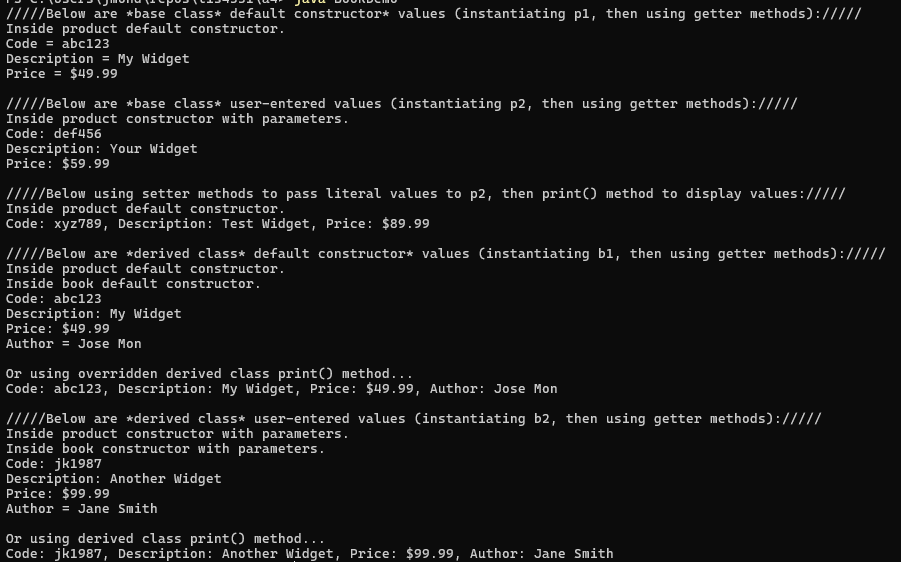

# 📚 SS12 - Book Class (Inherits Product Class)

## 📋 Description
This Java application demonstrates **class inheritance** by defining a `Book` class that **extends** the `Product` class. The `Book` class adds a new `author` field, includes constructors, and overrides the `print()` method to display all inherited and unique attributes.

---

## 💡 Features
- Inherits from the `Product` class (fields: `code`, `description`, `price`)
- Adds new field: `author`
- Includes:
  - No-arg and parameterized constructors
  - Getter and setter for `author`
  - Overridden `print()` method to include book-specific data
- Demonstrates:
  - Constructor chaining via `super()`
  - Object creation and method overriding

---

## 📂 Source Code
- [Product.java](../SS11_ProductClass/Product.java)  
- [Book.java](./Book.java)  
- [BookDemo.java](./BookDemo.java)

---

## 🖼️ Screenshot

---

## ⚙️ How to Run
1. Open `Product.java`, `Book.java`, and `BookDemo.java` in your Java IDE
2. Compile all files
3. Run `BookDemo.java`
4. Review both base and derived class outputs

---

## 🛠️ Technologies Used
- Java
- Object-Oriented Programming (OOP)
- Inheritance, encapsulation, and method overriding

---

## 📚 Concepts Practiced
- Class inheritance with `extends`
- Constructor chaining with `super()`
- Overriding methods in child classes
- Code reuse and modularity

---

## ✏️ Author
**Jose Mon**  
Florida State University | IT Student  
[LinkedIn](https://www.linkedin.com/in/jose-mon-675a67311/)
