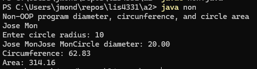

# ⚪ SS1 - Circle Area & Circumference (Non-OOP)

## 📋 Description
This basic Java program calculates the **area** and **circumference** of a circle using a user-input radius. It demonstrates procedural programming (non-OOP) with clear input/output handling.

---

## 💡 Features
- Accepts user input for radius
- Calculates:
  - Area = π * r²
  - Circumference = 2 * π * r
- Displays both results with formatted output
- Uses `Scanner` and `Math` classes

---

## 🖼️ Screenshot

---

## ⚙️ How to Run
1. Open `non.java` in your IDE (Eclipse, IntelliJ, etc.)
2. Compile and run the program
3. Enter a radius value when prompted
4. View calculated results for area and circumference

---

## 🛠️ Technologies Used
- Java (Console Application)
- `Scanner` for input
- `Math.PI` and `Math.pow()` for calculations

---

## 📚 Concepts Practiced
- Console input/output
- Basic math functions
- Variable usage and data types
- Clean procedural code structure

---

## ✏️ Author
**Jose Mon**  
Florida State University | IT Student  
[LinkedIn](https://www.linkedin.com/in/jose-mon-675a67311/)
