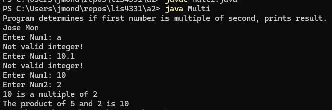

# ✖️ SS2 - Multiple Number Checker

## 📋 Description
This Java console application checks whether one number is a multiple of another. It prompts the user to enter two integers and determines if the first number is divisible evenly by the second.

---

## 💡 Features
- Takes two integer inputs from the user
- Uses modulo `%` operator to check divisibility
- Displays whether the numbers are multiples
- Includes basic input validation (optional)

---

## 📂 Source Code
- [MultipleNumber.java](./Multi.java)

---

## 🖼️ Screenshot

> 📸 Save your output screenshot as `screenshot.png` and place it in the `img/` folder.

---

## ⚙️ How to Run
1. Open `MultipleNumber.java` in your IDE (IntelliJ, Eclipse, etc.)
2. Compile and run the program
3. Input two integers when prompted
4. View the result (e.g., "6 is a multiple of 3")

---

## 🛠️ Technologies Used
- Java
- Console-based input/output using `Scanner`

---

## 📚 Concepts Practiced
- Basic arithmetic (`%` operator)
- User input handling with `Scanner`
- Conditional logic (`if-else`)
- Simple method structure (optional enhancement)

---

## ✏️ Author
**Jose Mon**  
Florida State University | IT Student  
[LinkedIn](https://www.linkedin.com/in/jose-mon-675a67311/)
