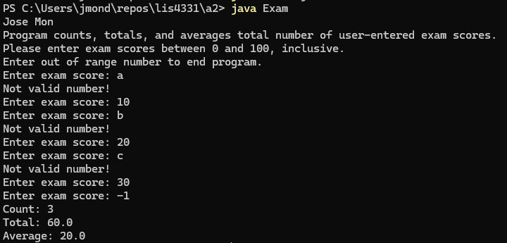

 # 🧩 SS3 - Nested Structures Logic

## 📋 Description
This Java console application allows users to **enter multiple exam scores** between 0 and 100. It continues prompting until an out-of-range number is entered, then calculates and displays the total, count, and average of valid scores.

---

## 💡 Features
- Repeated input using a `while (true)` loop
- Input validation using `hasNextDouble()` and error messages for invalid input
- Ignores invalid entries and handles user mistakes gracefully
- Terminates cleanly when a number outside 0–100 is entered
- Displays final count, total, and average of entered scores

---

## 📂 Source Code
- [Exam.java](./Exam.java)

---

## 🖼️ Screenshot

---

## ⚙️ How to Run
1. Open `Exam.java` in your IDE (Eclipse, IntelliJ, etc.)
2. Compile and run the program
3. Enter scores between `0` and `100` one by one
4. Type a number outside that range to end input
5. The program will display the count, total, and average

---

## 🛠️ Technologies Used
- Java
- `Scanner` for input
- `while` loop
- `if-else` for input range checking

---

## 📚 Concepts Practiced
- Input validation
- Data accumulation (count & total)
- Loops and control flow
- Defensive programming (handling invalid input)

---

## ✏️ Author
**Jose Mon**  
Florida State University | IT Student  
[LinkedIn](https://www.linkedin.com/in/jose-mon-675a67311/)