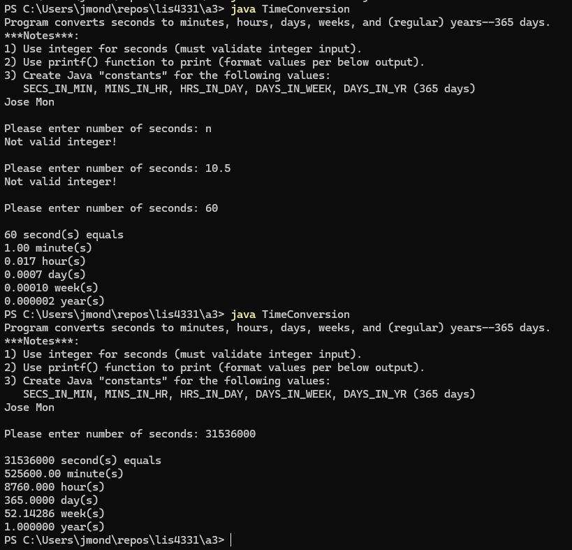

# ⏱️ SS4 - Time Conversion Program

## 📋 Description
This Java console application converts a user-input number of **seconds** into:
- Minutes
- Hours
- Days
- Weeks
- (Regular) Years (365 days)

It includes input validation and uses constants for conversion factors. The output is formatted using `printf()` for readability.

---

## 💡 Features
- Prompts user to enter a number of seconds (must be a valid integer)
- Rejects non-numeric or decimal inputs
- Converts total seconds into various time units using constants
- Outputs results formatted to six decimal places using `printf()`

---

## 🔧 Notes from Requirements
1. Must use integer input (validate user entry).
2. Use `printf()` function to format all output values.
3. Declare constants for:
   - `SECS_IN_MIN`
   - `MINS_IN_HR`
   - `HRS_IN_DAY`
   - `DAYS_IN_WEEK`
   - `DAYS_IN_YR` (set to 365 days)

---

## 📂 Source Code
- [TimeConversion.java](./TimeConversion.java)

---

## 🖼️ Screenshot

---

## ⚙️ How to Run
1. Open `TimeConversion.java` in your IDE.
2. Compile and run the file.
3. Enter an integer value for seconds.
4. Review the converted time output in minutes, hours, days, weeks, and years.

---

## 🛠️ Technologies Used
- Java (Console Application)
- `Scanner` for input
- `printf()` for formatted output
- Constants for conversion logic

---

## 📚 Concepts Practiced
- Input validation with `hasNextInt()`
- Constant declaration and usage
- Type casting and arithmetic
- Using `printf()` for formatted output

---

## ✏️ Author
**Jose Mon**  
Florida State University | IT Student  
[LinkedIn](https://www.linkedin.com/in/jose-mon-675a67311/)
