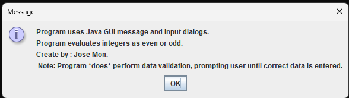
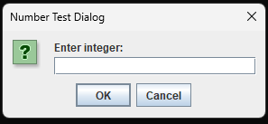
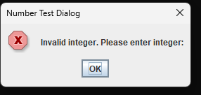
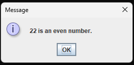
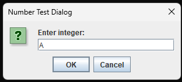

# 🔢 SS5 - Even or Odd Number Checker (GUI)

## 📋 Description
This Java application uses **GUI dialogs** to let the user input a number and check if it's even or odd. It performs **input validation** and continues prompting until a valid integer is entered.

---

## 💡 Features
- GUI input using `JOptionPane.showInputDialog`
- Custom messages for:
  - Successful result (even/odd)
  - Invalid input (non-integer values)
- Automatically repeats until a valid integer is provided
- Displays program credits and instructions at startup

---

## 📂 Source Code
- [EvenOddGUI.java](./SS5_EvenOdd_GUI/EvenOddValidator.java)

---

## 🖼️ Screenshots

### 🔹 Start Dialog  

### 🔹 Invalid Input - Character  

### 🔹 Invalid Input - Decimal  

### 🔹 Success - Even Result  

### 🔹 Info Message  

---

## ⚙️ How to Run
1. Open `EvenOddGUI.java` in your Java IDE (Eclipse, IntelliJ, etc.)
2. Compile and run the file
3. Follow the dialog prompts to enter a number
4. If input is valid, you'll see the result; if not, you’ll be prompted again

---

## 🛠️ Technologies Used
- Java
- Swing (`JOptionPane`)
- Conditional logic
- Input validation loop

---

## 📚 Concepts Practiced
- GUI interaction with users
- Defensive programming (loop until valid input)
- Basic modular arithmetic
- Displaying meaningful feedback via dialogs

---

## ✏️ Author
**Jose Mon**  
Florida State University | IT Student  
[LinkedIn](https://www.linkedin.com/in/jose-mon-675a67311/)
