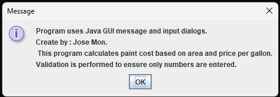
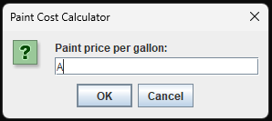
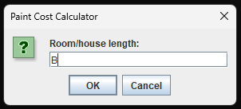
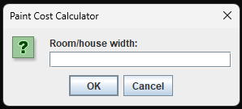
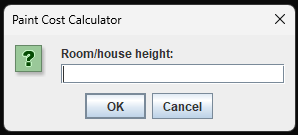
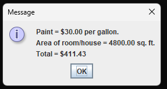

# 🎨 SS6 - Paint Calculator (GUI)

## 📋 Description
This Java GUI application calculates the **total cost of paint** needed to cover a room or house based on its **dimensions** and the **price per gallon**. It uses `JOptionPane` for all input and output dialogs, and includes error handling to validate numeric input.

---

## 💡 Features
- GUI prompts for:
  - Paint price per gallon
  - Room/house **length**, **width**, and **height**
- Validates that all inputs are numeric
- Calculates:
  - Total area in square feet
  - Total gallons required
  - Final cost (area ÷ coverage rate × price)
- Outputs a final summary with formatted cost

---

## 📂 Source Code
- [PaintCalculator.java](./PaintCostCalculator.java)

---

## 🖼️ Screenshots

### ℹ️ Program Info Message  

### ❌ Invalid Input – Non-Numeric  

### 🏠 Enter Room Length  

### ➡️ Enter Room Width  

### 📐 Enter Room Height  

### ✅ Final Result Display  

---

## ⚙️ How to Run
1. Open `PaintCalculator.java` in your Java IDE (IntelliJ, Eclipse, etc.)
2. Compile and run the file
3. Enter values when prompted
4. Final result will display area and total cost

---

## 🧮 Calculation Logic
- **Area = Length × Width × Height**
- **1 gallon = 350 sq ft of coverage**
- **Total Cost = (Area ÷ 350) × Price**

---

## 🛠️ Technologies Used
- Java
- Java Swing (`JOptionPane`)
- Arithmetic and string formatting
- Input validation via loops and `try-catch`

---

## 📚 Concepts Practiced
- GUI interaction and user input
- Validation and exception handling
- Basic math and logic operations
- Dynamic string formatting for output

---

## ✏️ Author
**Jose Mon**  
Florida State University | IT Student  
[LinkedIn](https://www.linkedin.com/in/jose-mon-675a67311/)
