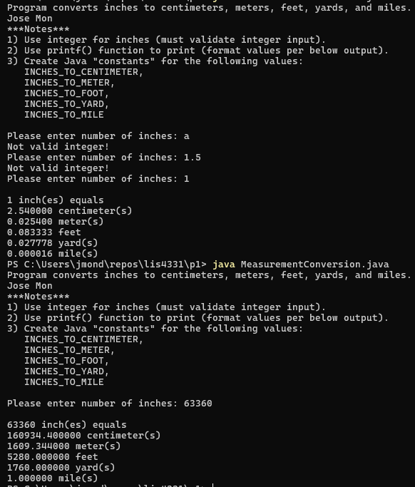

# 📏 SS7 - Measurement Conversion Tool (Console)

## 📋 Description
This Java console application converts a user-input **inch** value into:
- Centimeters  
- Meters  
- Feet  
- Yards  
- Miles  

The program uses predefined constants and formatted output via `printf()`, and includes input validation to ensure only integers are processed.

---

## 💡 Features
- Converts inches to 5 different units using standard conversion rates
- Rejects invalid input (non-integer or decimal values)
- Uses constants for clarity and reusability
- Outputs values with clean formatting (e.g., 6 decimal places for precision)

---

## 🔧 Notes from Assignment
- Must use an **integer** input for inches
- Use `printf()` to format output
- Define constants for:
  - `INCHES_TO_CENTIMETER`
  - `INCHES_TO_METER`
  - `INCHES_TO_FOOT`
  - `INCHES_TO_YARD`
  - `FEET_TO_MILE`

---

## 📂 Source Code
- [MeasurementConversion.java](./MeasurementConversion.java)

---

## 🖼️ Screenshot

> 📸 Save your console output screenshot as `screenshot.png` and place it in the `img/` folder of this project.

---

## ⚙️ How to Run
1. Open `MeasurementConversion.java` in your Java IDE (e.g., IntelliJ, Eclipse)
2. Compile and run the program
3. Enter an integer number of inches
4. View the results in centimeters, meters, feet, yards, and miles

---

## 🛠️ Technologies Used
- Java
- Console input with `Scanner`
- `printf()` formatting
- Constants for unit conversion

---

## 📚 Concepts Practiced
- Input validation with `hasNextInt()`
- Use of constants
- Unit conversion
- Formatted console output

---

## ✏️ Author
**Jose Mon**  
Florida State University | IT Student  
[LinkedIn](https://www.linkedin.com/in/jose-mon-675a67311/)
