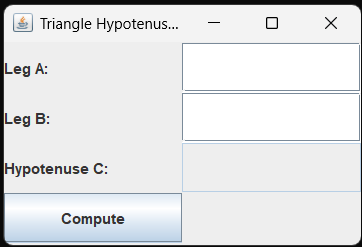

# 📐 SS8 - Triangle Hypotenuse Calculator (GUI)

## 📋 Description
This Java Swing application calculates the **hypotenuse (C)** of a right triangle using the **Pythagorean Theorem**:  
**C = √(A² + B²)**

Users enter values for **Leg A** and **Leg B**, and the GUI computes the hypotenuse when the **Compute** button is clicked.

---

## 💡 Features
- GUI with labeled text fields for:
  - Leg A
  - Leg B
  - Hypotenuse C (calculated automatically)
- Button to compute result using `Math.sqrt()`
- Results are rounded to 2 decimal places
- Uses layout manager for clean visual structure

---

## 📂 Source Code
- [HypotenuseCalculator.java](./HypotenuseCalculator.java)

---

## 🖼️ Screenshot

---

## ⚙️ How to Run
1. Open `HypotenuseCalculator.java` in your IDE
2. Compile and run the program
3. Enter two leg lengths (A and B)
4. Click **Compute** to display the hypotenuse

---

## 🛠️ Technologies Used
- Java
- Java Swing (`JFrame`, `JLabel`, `JTextField`, `JButton`)
- Event handling with `ActionListener`
- `Math.pow()` and `Math.sqrt()` for calculations

---

## 📚 Concepts Practiced
- GUI layout and user interaction
- Pythagorean Theorem implementation
- Real-time calculation on button click
- Numeric formatting and field validation

---

## ✏️ Author
**Jose Mon**  
Florida State University | IT Student  
[LinkedIn](https://www.linkedin.com/in/jose-mon-675a67311/)
