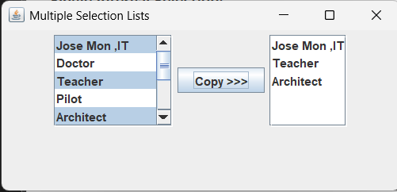

# ✅ SS9 - Multiple Selection List (GUI)

## 📋 Description
This Java Swing application demonstrates how to work with **multiple-selection JLists**. The user can select one or more **professions** from the left list, and when they click the **Copy** button, the selected items are transferred to the right list.

---

## 💡 Features
- Two `JList` components: one for selection, one for output
- Scrollable lists with a maximum of 5 visible rows
- Allows **multiple selection** on the left and **single selection** on the right
- Uses a `JButton` with an `ActionListener` to trigger item transfer
- Dynamically updates the destination list with selected values

---

## 🧑‍💼 List of Sample Professions
- Jose Mon ,IT  
- Doctor  
- Teacher  
- Pilot  
- Architect  
- Graphic Designer  
- Police Officer  
- Firefighter  
- Lawyer  
- Electrician  

---

## 📂 Source Code
- [MultipleSelectionListDemo.java](./MultipleSelectionListDemo.java)  
- [MultipleSelectionFrame.java](./MultipleSelectionFrame.java)

---

## 🖼️ Screenshot

---

## ⚙️ How to Run
1. Open both `.java` files in your Java IDE
2. Compile and run `MultipleSelectionListDemo.java`
3. Select multiple items from the **left list**
4. Click **Copy >>>** to populate the **right list** with selections

---

## 🛠️ Technologies Used
- Java
- Swing Components:
  - `JFrame`, `JList`, `JScrollPane`, `JButton`
- `DefaultListModel` for dynamic list population
- Event-driven programming with `ActionListener`

---

## 📚 Concepts Practiced
- GUI component layout and management
- List models and selection modes (`MULTIPLE_INTERVAL_SELECTION`)
- Real-time user interaction
- Updating and clearing dynamic data structures

---

## ✏️ Author
**Jose Mon**  
Florida State University | IT Student  
[LinkedIn](https://www.linkedin.com/in/jose-mon-675a67311/)
